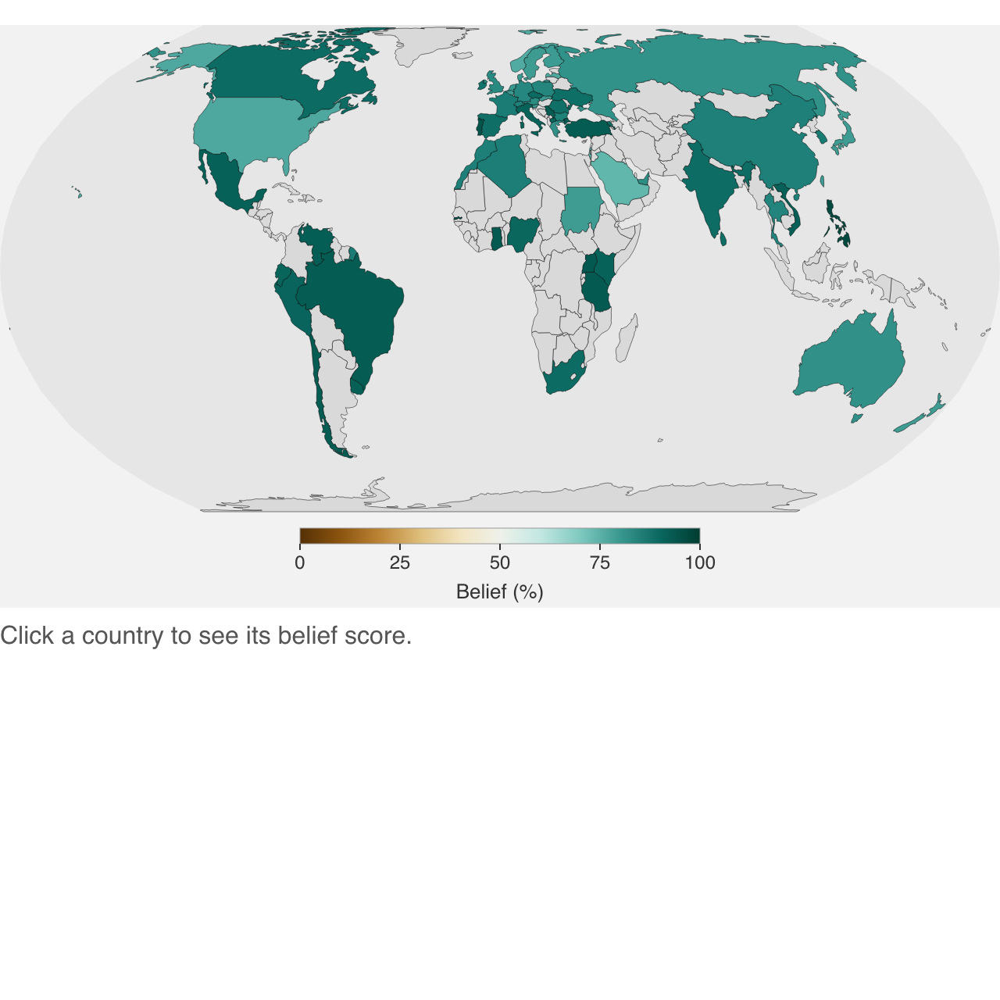
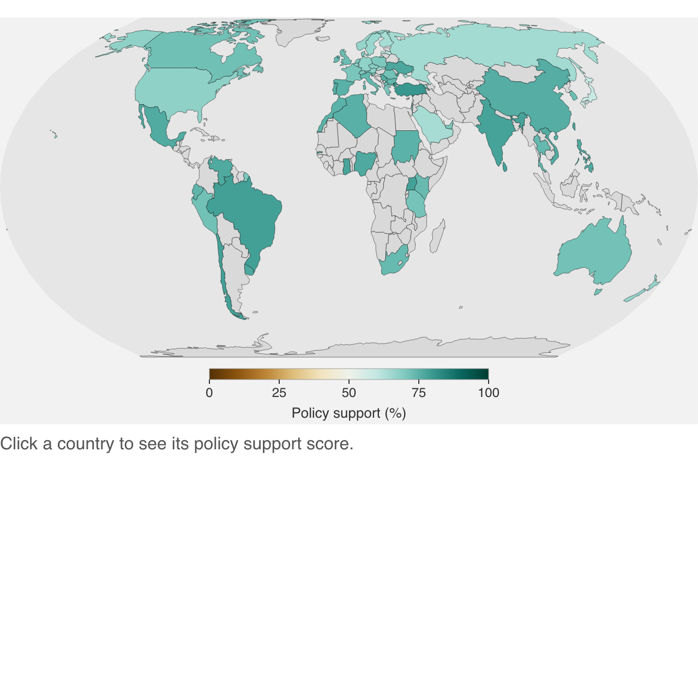

# Climate Widgets

Small, self-contained interactive figures for teaching climate science. Each widget is one page, and each page ends with a copy-pastable snippet so you can drop the widget into your own site or LMS — as an iframe, or as a script tag that renders it inline.

  <a class="card" href="./draw-the-future/">
    <h2>Draw the future</h2>
    
  </a>
  <a class="card" href="./temperature-trend/">
    <h2>Temperature trends</h2>
    
  </a>
  <a class="card" href="./sst-daily/">
    <h2>Daily sea surface temperature</h2>
    
  </a>
  <a class="card" href="./belief-map/">
    <h2>Belief in climate change</h2>
    
  </a>
  <a class="card" href="./policy-support-map/">
    <h2>Support for climate policy</h2>
    
  </a>
  <a class="card" href="./climate-action-support/">
    <h2>Support for climate action</h2>
    
  </a>

