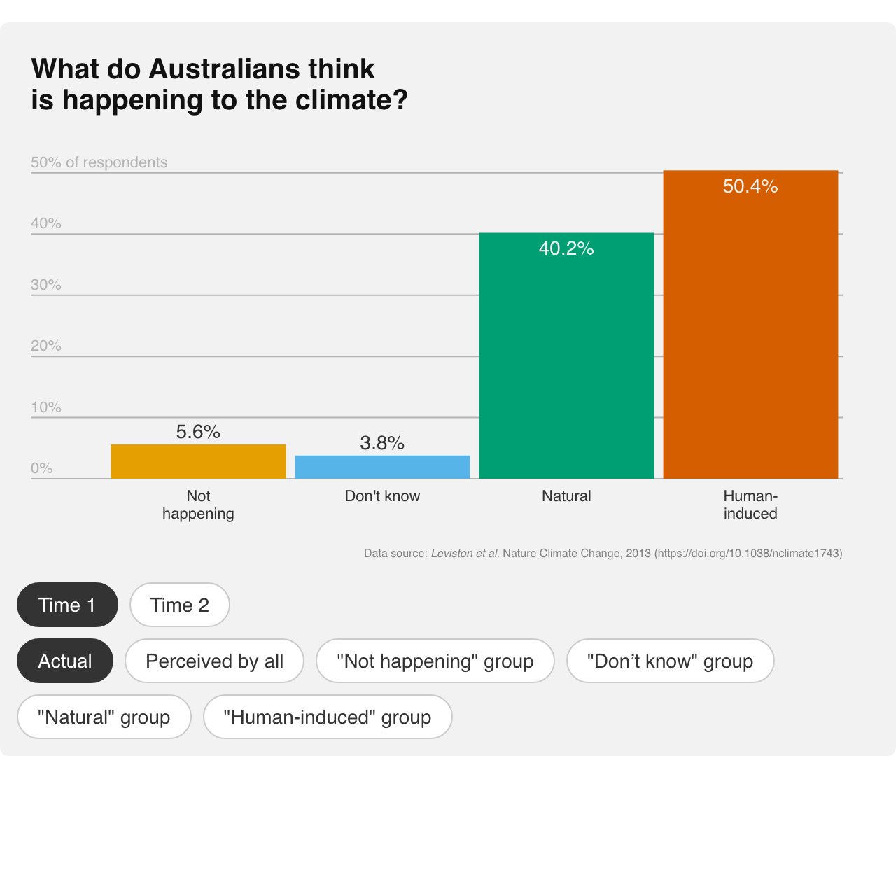
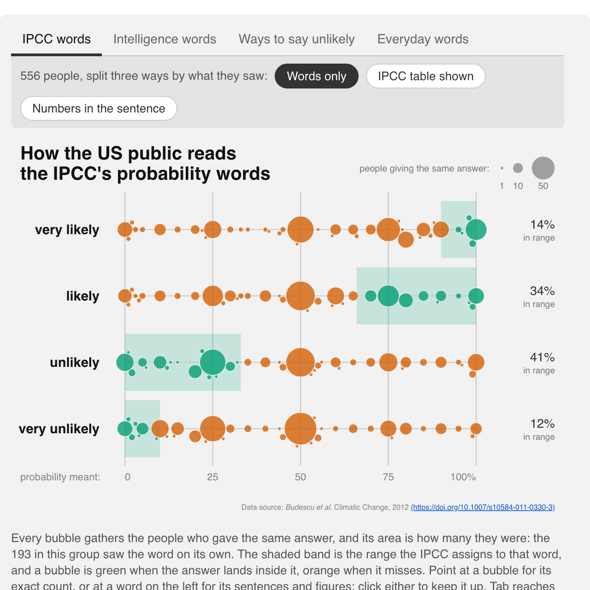
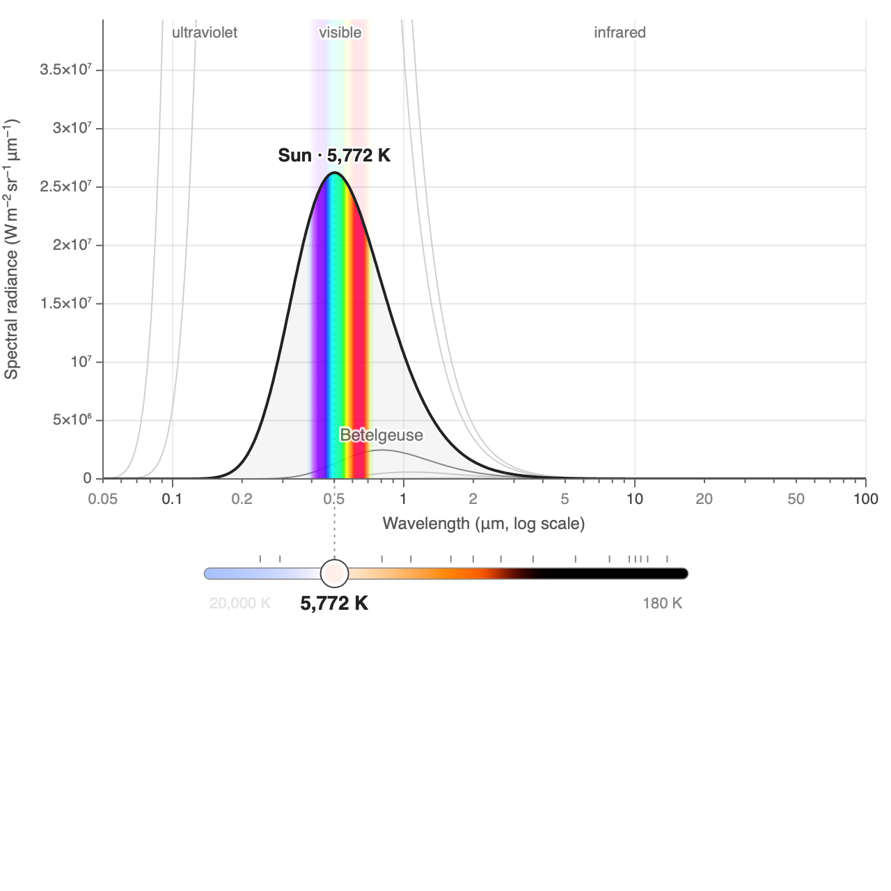
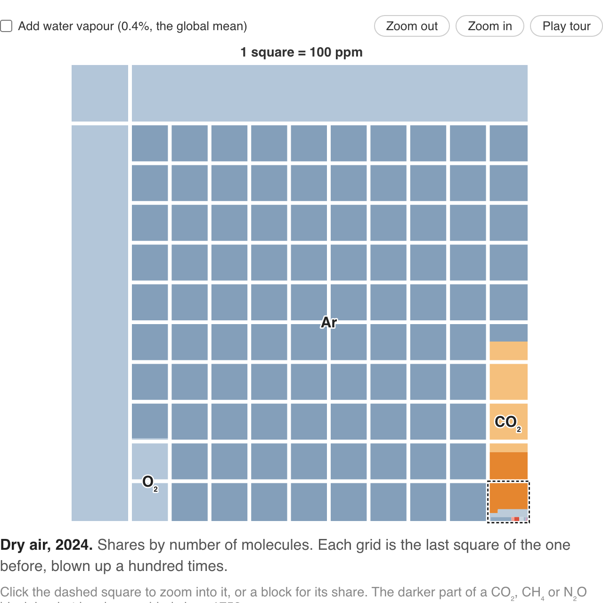
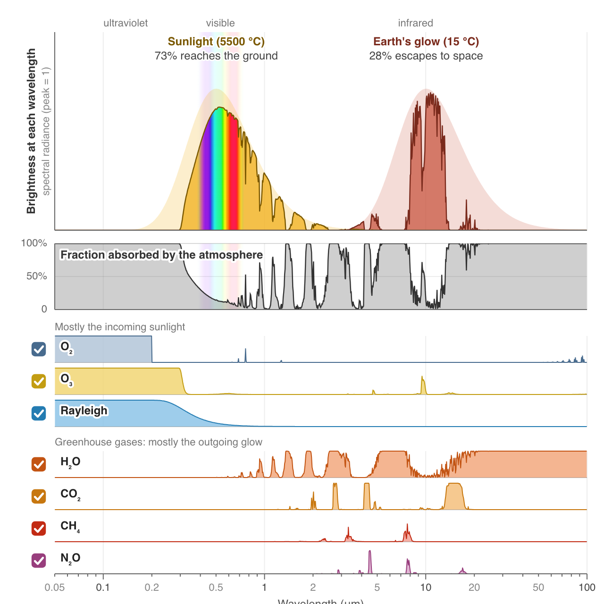

# Climate Widgets

Small, self-contained interactive figures for teaching climate science. Each widget is one page, and each page ends with a copy-pastable snippet so you can drop the widget into your own site or LMS — as an iframe, or as a script tag that renders it inline.

  <a class="card" href="./draw-the-future/">
    <h2>Draw the future</h2>
    
  </a>
  <a class="card" href="./temperature-trend/">
    <h2>Temperature trends</h2>
    
  </a>
  <a class="card" href="./sst-daily/">
    <h2>Daily sea surface temperature</h2>
    
  </a>
  <a class="card" href="./vlasceanu-etal-2024/">
    <h2>Vlasceanu et al. 2024</h2>
    
  </a>
  <a class="card" href="./andre-etal-2024/">
    <h2>Andre et al. 2024</h2>
    
  </a>
  <a class="card" href="./leiserowitz-etal-2026/">
    <h2>Global Warming's Six Americas</h2>
    
  </a>
  <a class="card" href="./hickman-etal-2021/">
    <h2>Hickman et al. 2021</h2>
    
  </a>
  <a class="card" href="./consensus-studies/">
    <h2>Studies of the scientific consensus</h2>
    
  </a>
  <a class="card" href="./leviston-etal-2013/">
    <h2>Actual vs. perceived opinion</h2>
    
  </a>
  <a class="card" href="./probability-words/">
    <h2>What a probability word means</h2>
    
  </a>
  <a class="card" href="./blackbody-radiation/">
    <h2>Black-body radiation</h2>
    
  </a>
  <a class="card" href="./atmospheric-composition/">
    <h2>What the air is made of</h2>
    
  </a>
  <a class="card" href="./atmospheric-transmission/">
    <h2>Atmospheric transmission</h2>
    
  </a>

